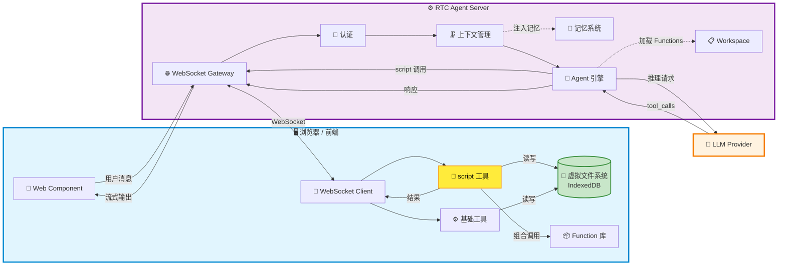

# 🤖 RTC Agent

### **Remote Tool Calling — 让你的网站，3 行代码拥有 AI 助手**

*不是截图识别，不是 DOM 爬取。AI 通过前端工具直接操作网站，每一步都透明可观测。*


---

## 🎯 为什么选择 RTC Agent？

### 🚀 接入极简

几行 JavaScript，你的网站就能对话式操控。无需改造后端，无需训练模型。

### 👁️ 完全透明

AI 做了什么、为什么这么做、改了哪些数据——所有操作实时可见，不再是黑箱。

### 💰 高效省钱

相比视觉解析方案，Token 消耗降低 **70%+**；相比 DOM 爬取方案，错误率下降 **50%+**。

---

## 📊 对比其他 AI 助手方案

| 方案 | 接入成本 | 可观测性 | Token 成本 | 错误率 | 隐私安全 |
|:----:|:-------:|:-------:|:---------:|:-----:|:-------:|
| 🥇 **RTC Agent** | ⭐⭐⭐⭐⭐ 几行代码 | ⭐⭐⭐⭐⭐ 完全透明 | ⭐⭐⭐⭐⭐ 低 | ⭐⭐⭐⭐⭐ 低 | ⭐⭐⭐⭐⭐ 数据不出前端 |
| 🥈 视觉解析 (截图+OCR) | ⭐⭐⭐ 中等 | ⭐⭐ 黑箱 | ⭐ 极高 | ⭐⭐ 较高 | ⭐⭐ 需上传截图 |
| 🥉 DOM 爬取 (服务端解析) | ⭐⭐ 复杂 | ⭐⭐⭐ 部分可见 | ⭐⭐⭐ 中等 | ⭐⭐⭐ 中等 | ⭐⭐⭐ 数据上云 |
| 浏览器插件 | ⭐⭐ 需安装 | ⭐⭐⭐⭐ 较好 | ⭐⭐⭐ 中等 | ⭐⭐⭐ 中等 | ⭐⭐⭐⭐ 本地运行 |

---

## 💡 RTC Agent 是什么？

> **一句话定义**：开源的网站 AI 助手后端，通过标准化的 Remote Tool Calling 协议，让你的网站几行代码接入透明、高效、低成本的 AI 助手。

RTC Agent 让 AI 在服务端推理，**工具在前端执行**——读取页面内容、操作虚拟文件系统、调用业务接口——所有过程通过 WebSocket 实时同步，对你的用户完全可见。

---

## ✨ 核心能力

### 📂 前端虚拟文件系统

基于 **IndexedDB** 构建，AI 工具（`read` / `write` / `ls` / `grep`）直接操作前端文件，数据不离开用户浏览器。

### 🔑 Script 工具 + Function 组合

开发者**只需维护自己的 Function 库**，Agent 通过 `script` 工具在前端执行，并能**自由组合多个 Function** 完成复杂任务——无需预定义 workflow。

> 💡 **开发者视角**：你只需定义业务原子能力（Function），Agent 自己学会如何组合它们。就像给 AI 一套乐高积木，它自己会拼出你想要的形状。

### 💬 实时通信

基于 **Centrifuge WebSocket**，消息双向推送，支持流式输出、工具调用进度、状态同步。

### 🧠 记忆系统

双层记忆：**Session Memory**（会话上下文压缩）+ **User Memory**（跨会话长期记忆，支持向量检索）。AI 真正"记住"你的用户。

### 🗜️ 上下文管理

自动压缩长对话，Token 消耗可控。告别"上下文超限"报错。

### 🤖 子代理 + 🎯 目标驱动

复杂任务自动拆解，多个专业子代理并行工作；AI 设定、追踪、完成多步骤目标，turn-boundary checkpoint 保证任务不丢失。

---

## 🏗️ 架构



---

## 🔄 工作原理

```
┌─────────────────────────────────────────────────────────────┐
│  1️⃣  用户在前端发送消息，通过 WebSocket 到达 RTC Agent Server  │
│  2️⃣  Server 注入记忆、压缩上下文，加载 Function 清单           │
│  3️⃣  LLM 根据任务需求，决定调用哪些 Function                  │
│  4️⃣  前端 script 工具执行开发者适配的 Function                │
│  5️⃣  Agent 自由组合多个 Function，完成复杂任务                 │
│  6️⃣  执行结果回传 Server，继续推理，直到生成最终响应            │
└─────────────────────────────────────────────────────────────┘
```

### 🔑 关键差异

| | 传统方案 | RTC | RTC + Function |
|---|---------|-----|----------------|
| **工具执行位置** | 服务端 ❌ | 前端 ✅ | 前端 ✅ |
| **数据流向** | 上云 🔒 | 留在用户设备 🔐 | 留在用户设备 🔐 |
| **扩展方式** | 改服务端代码 | 定义前端工具 | **只需定义 Function，Agent 自己学会组合** |

---

## 🚀 开始使用

> 🚧 **文档建设中** — 快速上手指南、API 文档、部署教程即将推出。
>
> 如有兴趣提前体验或参与共建，欢迎 [提交 Issue](https://github.com/rtc-agent/rtc-agent/issues) 或联系维护者。

---

## 🛠️ 技术栈

### 后端

- Go 1.27
- Cobra CLI
- GORM + PostgreSQL
- Redis

### AI

- Anthropic SDK
- OpenAI 兼容 API
- Eino 框架

### 通信

- Centrifuge WebSocket
- 流式输出
- 双向消息推送

### 可观测

- OpenTelemetry
- Jaeger 追踪
- Prometheus 指标

---

### 📄 许可证

[MIT License](./LICENSE)

**Made with ❤️ by RTC Agent Team**
