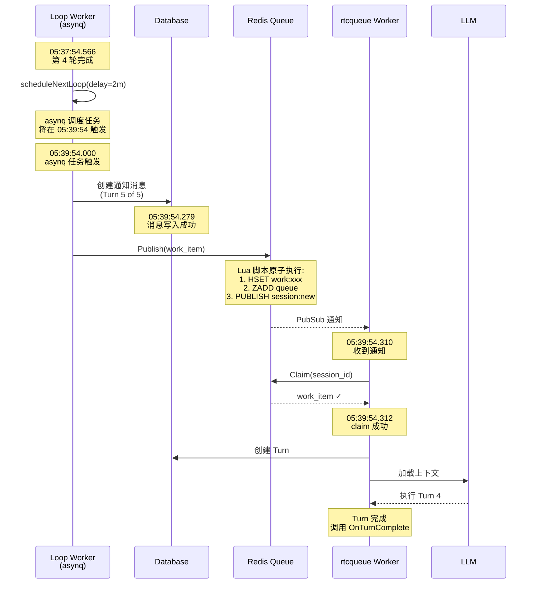
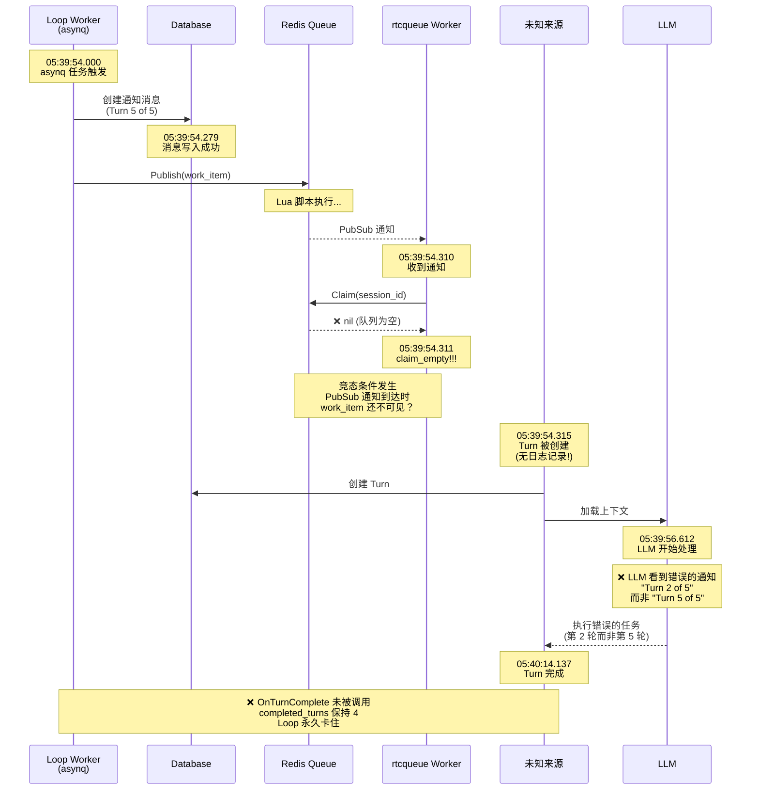

# Bug 2：rtcqueue 竞态条件时序图

## 正常流程（Turn 1-4）



## 异常流程（Turn 5）



## 问题分析

### 竞态条件可能的原因

1. **Redis PubSub 可靠性问题**
   - PubSub 是 fire-and-forget 模式
   - 如果订阅者在消息发布时短暂断连，会丢失消息
   - 但这里是收到了通知，只是 claim 时队列为空

2. **Redis 复制延迟（如果使用集群）**
   - 写入发生在 master
   - 读取发生在 replica
   - 复制延迟可能导致读取到旧数据

3. **Lua 脚本执行时序**
   - 虽然 Lua 脚本是原子的，但 PUBLISH 在脚本最后执行
   - 理论上 work_item 应该在 PUBLISH 前就已可见
   - 除非...有其他 worker 在 PUBLISH 后立即 claim 走了？

### 关键疑问

```
05:39:54.311  worker.claim_empty  ← 队列为空
05:39:54.315  Turn 被创建         ← 4ms 后 Turn 出现了
```

**问题**：如果 claim_empty，Turn 是如何被创建的？

**假设**：
- 有一个"影子" worker（可能是 server-2 的 worker）在 claim_empty 后立即 claim 成功了
- 或者 work_item 在 claim_empty 后的 4ms 内到达
- 或者 Turn 是通过其他代码路径创建的（不经过 rtcqueue）

需要进一步调查：
1. 检查 server-2 的日志（可能不在 tmp.log 中）
2. 检查是否有其他创建 Turn 的代码路径
3. 检查 Redis 的配置（是否集群模式）
