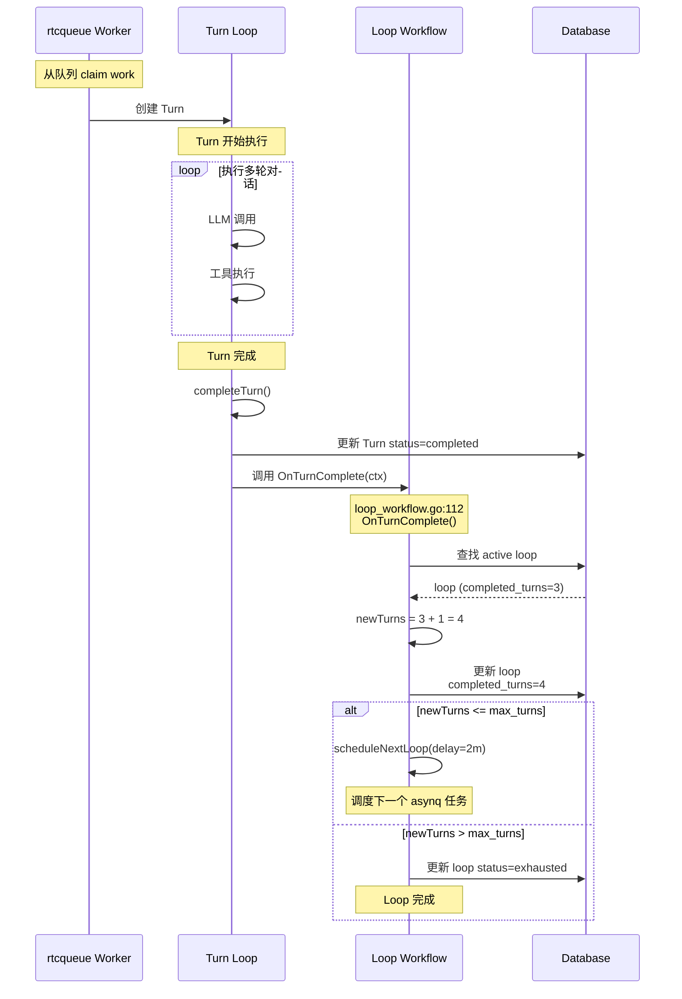
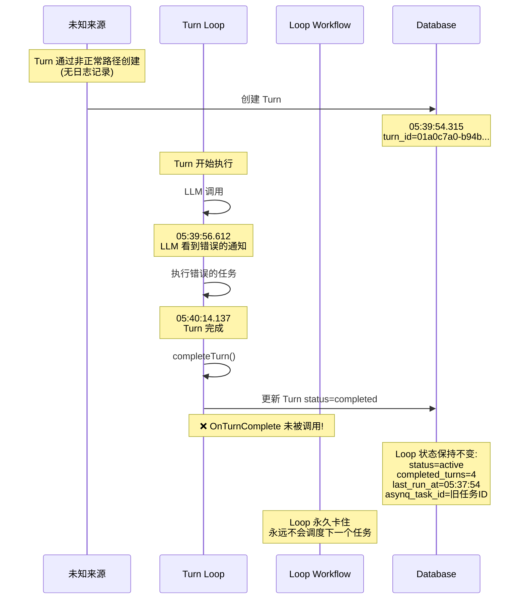
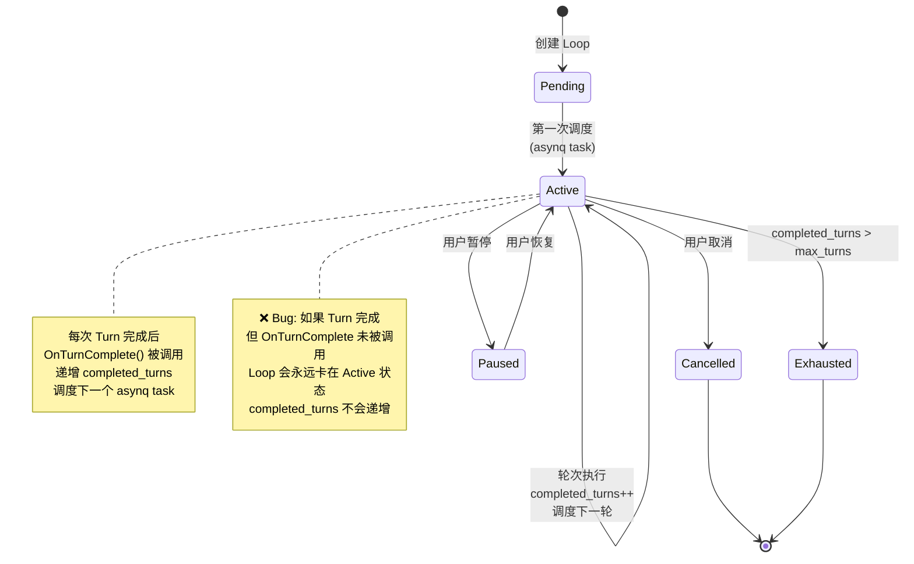
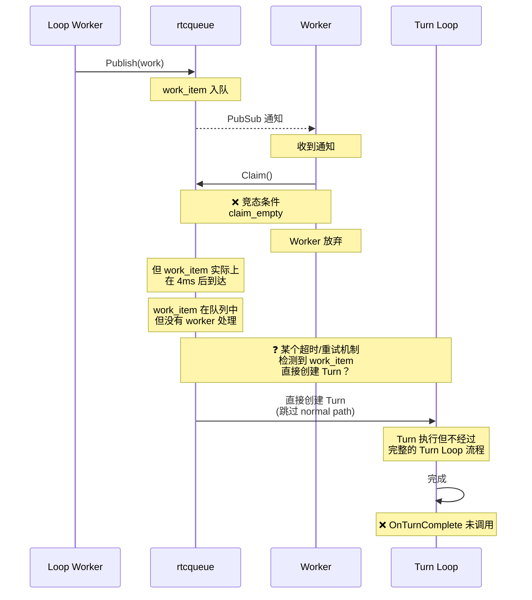
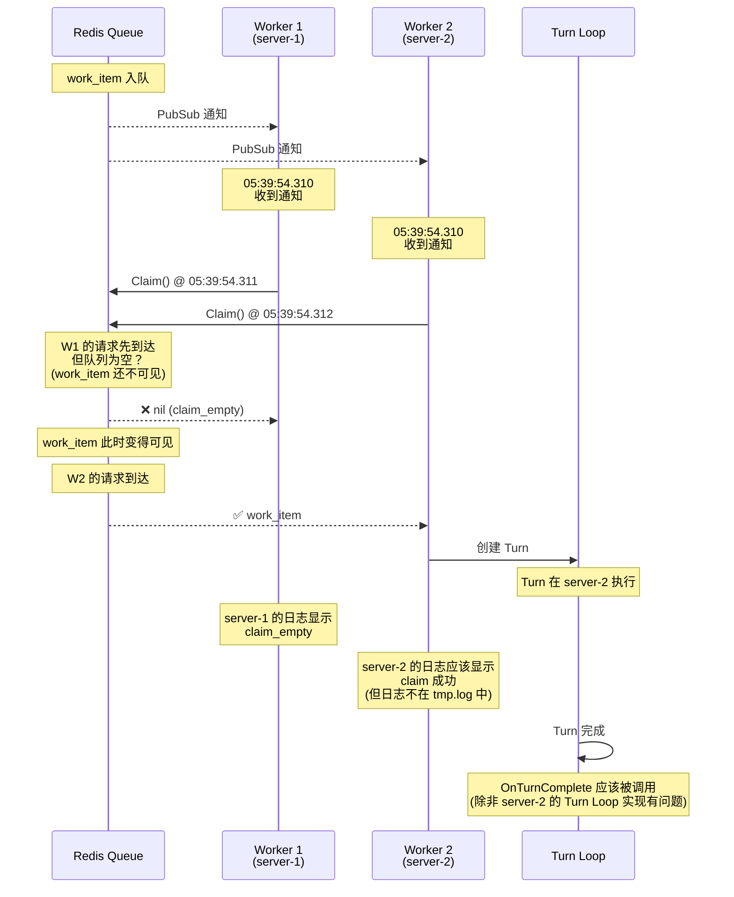

# Bug 3：OnTurnComplete 未被调用时序图

## 正常流程：Turn 与 Loop 的协作



## 异常流程：Turn 完成但 OnTurnComplete 未触发



## Turn Loop 生命周期



## 代码调用链分析

### 正常的调用链

```go
// 1. rtcqueue worker 处理 work
// pkg/rtc-queue/worker.go
func (w *Worker) processWork(ctx context.Context, claim *ClaimResult) {
    // ...
    workPayload := turnagent.WorkPayload{...}
    
    // 2. 调用 turn agent 处理
    // internal/agent/turn_agent.go
    agent.Process(ctx, workPayload)
    
    // 3. 创建 Turn Loop
    // internal/agent/turn_loop.go
    turnLoop := NewTurnLoop(...)
    
    // 4. 执行 Turn
    turnLoop.Run(ctx)
    
    // 5. Turn 完成后调用 CompleteTurn
    turnLoop.CompleteTurn(ctx)
    
    // 6. CompleteTurn 内部调用 command registry 的 hooks
    // internal/agent/turn_loop.go
    func (l *TurnLoop) CompleteTurn(ctx context.Context) error {
        // ...
        // 调用所有 command 的 OnTurnComplete hook
        l.registry.OnTurnComplete(ctx)
        // ...
    }
    
    // 7. Command registry 调用 LoopWorkflow.OnTurnComplete
    // internal/agent/loop_workflow.go:112
    func (l *LoopWorkflow) OnTurnComplete(ctx command.Context) error {
        // 更新 loop.completed_turns
        // 调度下一个 asynq task
    }
}
```

### 异常的调用链（推测）

```go
// Turn 通过非正常路径创建
// 可能是某个 resume/retry 逻辑
// 没有经过完整的 Turn Loop 流程

??? -> 直接创建 Turn (数据库写入)
    -> LLM 调用
    -> Turn 完成
    -> completeTurn() 被调用
    -> ❌ 但没有调用 registry.OnTurnComplete()

结果：
- Turn 在数据库中 status=completed
- Loop 的 completed_turns 没有递增
- Loop 的 asynq_task_id 指向已触发的旧任务
- Loop 永久卡住
```

## 可能的根因

### 假设 1：Turn 通过 "resume" 路径创建



### 假设 2：多个 Worker 竞争



## 需要验证的问题

1. **server-2 是否成功 claim 了 work_item？**
   - 检查 server-2 的完整日志
   - 检查 Turn 的 client_id 是否来自 server-2

2. **Turn 是否经过完整的 Turn Loop 流程？**
   - 检查是否有 `createTurn.created` 日志（可能在 server-2）
   - 检查是否有 `normalizeMessagesForLLM.applied` 日志

3. **OnTurnComplete 是否被调用？**
   - 检查是否有 `loopWorkflow.onTurnComplete` 日志
   - 检查 Loop 的 `last_run_at` 是否更新

4. **如果 OnTurnComplete 被调用，为什么 completed_turns 没有递增？**
   - 检查是否有事务回滚
   - 检查是否有并发更新冲突
