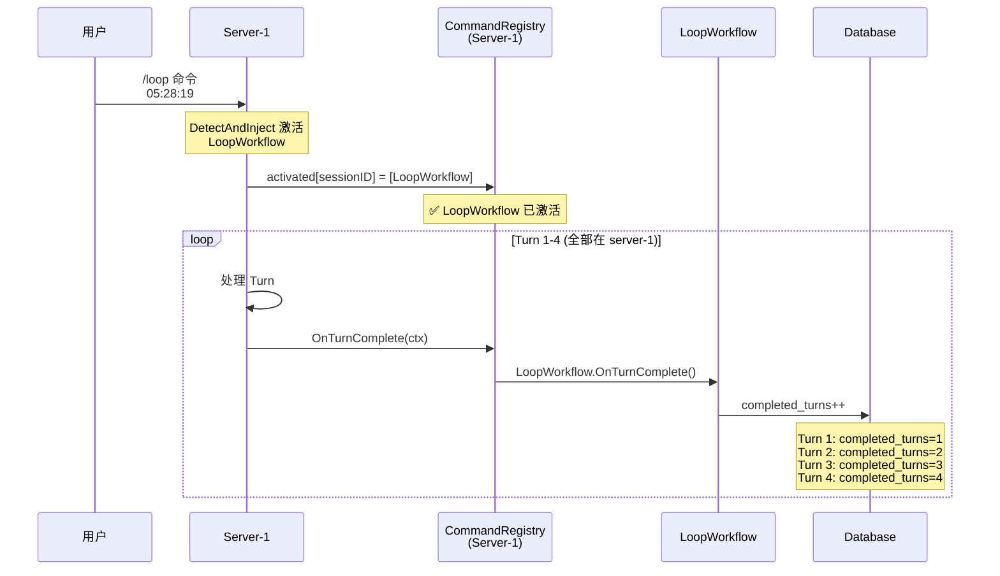
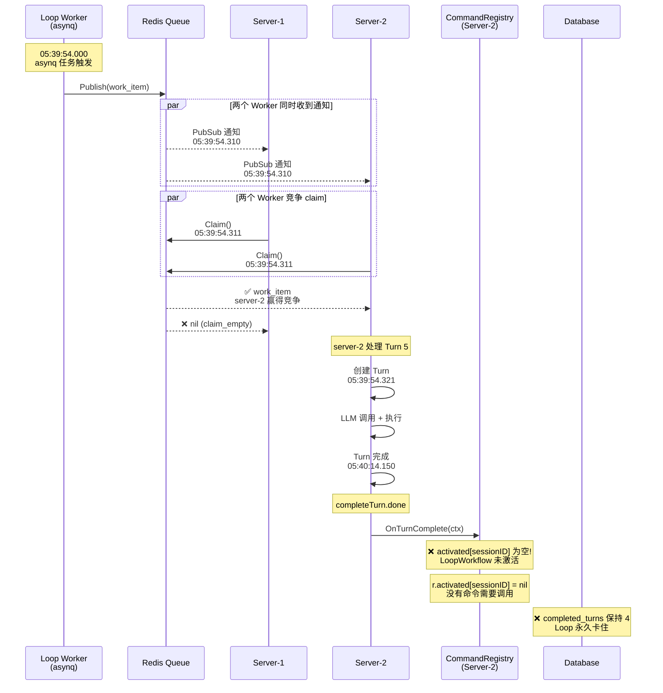

# Turn Loop 停止问题 - 最终根因分析

**日期**: 2026-09-22  
**Session**: `01a0c796-1ecc-72c9-80b9-b214e6ef6d68`  
**Loop**: `01a0c796-8fe7-74c7-a12d-b05e6a8a13b7`  
**严重程度**: P0 - 核心功能缺陷

## 执行摘要

Loop 在执行第 5 轮时停止，根本原因是 **CommandRegistry 的激活状态是内存状态，没有在多服务器之间共享**。当 turn 5 被 server-2 处理时，server-2 的 CommandRegistry 没有 LoopWorkflow 的激活记录，导致 OnTurnComplete hook 没有被调用。

## 完整时间线

### 正常流程（Turn 1-4，全部在 server-1 上处理）



### 异常流程（Turn 5，在 server-2 上处理）



## 根本原因

### Bug：CommandRegistry 激活状态不跨服务器共享

**问题描述**：
- CommandRegistry 使用内存 map (`r.activated`) 存储每个 session 的激活命令
- 当用户发送 `/loop` 命令时，LoopWorkflow 只在**处理该请求的服务器**的 CommandRegistry 中被激活
- 其他服务器的 CommandRegistry 没有 LoopWorkflow 的激活记录
- 当后续的 turn 被其他服务器处理时，OnTurnComplete hook 不会被调用

**代码位置**：
- `/Users/leichujun/Workspaces/rtc-agent/server/internal/agent/command/registry.go:19`
  ```go
  type CommandRegistry struct {
      mu        sync.RWMutex
      registered []Command           // 注册的命令定义（全局共享）
      activated  map[uuid.UUID][]*activatedEntry  // ❌ 内存状态，不跨服务器
  }
  ```

- `/Users/leichujun/Workspaces/rtc-agent/server/internal/agent/data_context_injection.go:74`
  ```go
  contributions, err := h.deps.CommandRegistry.DetectAndInject(cmdCtx, lastUserContent)
  // DetectAndInject 只在当前服务器的 CommandRegistry 中激活命令
  ```

**日志证据**：
```
# Turn 1-4 的 loopWorkflow 日志都在 server-1
server-1: 05:31:04.789 loopWorkflow.loop_extended completed_turns=1
server-1: 05:33:27.055 loopWorkflow.loop_extended completed_turns=2
server-1: 05:35:49.565 loopWorkflow.loop_extended completed_turns=3
server-1: 05:37:54.568 loopWorkflow.loop_extended completed_turns=4

# Turn 5 在 server-2 处理
server-2: 05:40:14.150 completeTurn.done
server-2: ❌ 没有 loopWorkflow 日志
```

**数据库证据**：
```sql
SELECT status, completed_turns, last_run_at FROM loops WHERE id = '01a0c796-8fe7-74c7-a12d-b05e6a8a13b7';
-- 结果：status=active, completed_turns=4, last_run_at=05:37:54
-- ❌ completed_turns 没有递增到 5
```

## 影响范围

**受影响的场景**：
1. **多服务器部署**：任何使用多服务器（server-1, server-2, ...）的部署都会受到影响
2. **Command 激活后跨服务器执行**：当命令在 server-A 激活，但后续 turn 在 server-B 执行时
3. **所有依赖 OnTurnComplete hook 的功能**：
   - LoopWorkflow（循环任务）
   - GoalWorkflow（目标执行）
   - 其他实现了 TurnHook 接口的命令

**不受影响的场景**：
1. **单服务器部署**：所有 turn 都在同一台服务器上处理
2. **会话亲和性（Session Affinity）**：如果配置了负载均衡器确保同一 session 的所有请求都路由到同一台服务器

## 解决方案

### 方案 1：持久化 CommandRegistry 激活状态到数据库（推荐，P0）

**思路**：将 `r.activated` map 持久化到数据库，每次服务器启动或处理请求时从数据库加载。

**实现步骤**：

1. **创建数据库表**：
```sql
CREATE TABLE command_activations (
    id UUID PRIMARY KEY DEFAULT gen_random_uuid(),
    session_id UUID NOT NULL REFERENCES sessions(id) ON DELETE CASCADE,
    command_name TEXT NOT NULL,
    args JSONB,
    activated_at TIMESTAMPTZ NOT NULL DEFAULT NOW(),
    last_triggered_at TIMESTAMPTZ,
    scope TEXT NOT NULL, -- 'session' or 'oneshot'
    UNIQUE(session_id, command_name)
);

CREATE INDEX idx_command_activations_session ON command_activations(session_id);
```

2. **修改 CommandRegistry**：
```go
type CommandRegistry struct {
    mu        sync.RWMutex
    registered []Command
    activated  map[uuid.UUID][]*activatedEntry
    repo       CommandActivationRepo  // 新增：数据库访问层
}

// DetectAndInject 激活命令时，同时写入数据库
func (r *CommandRegistry) DetectAndInject(ctx Context, lastUserContent string) ([]*PromptContribution, error) {
    // ... 现有的检测和激活逻辑 ...
    
    // 新增：持久化到数据库
    if err := r.repo.Save(ctx, sessionID, commandName, args, scope); err != nil {
        r.logger.Warn(ctx, "command_activation.persist_failed", ...)
    }
    
    return contributions, nil
}

// 新增：从数据库加载激活状态
func (r *CommandRegistry) LoadActivations(ctx Context, sessionID uuid.UUID) error {
    activations, err := r.repo.FindBySession(ctx, sessionID)
    if err != nil {
        return err
    }
    
    r.mu.Lock()
    defer r.mu.Unlock()
    
    for _, act := range activations {
        cmd := r.findByName(act.CommandName)
        if cmd == nil {
            continue
        }
        r.activated[sessionID] = append(r.activated[sessionID], &activatedEntry{
            cmd:  cmd,
            args: act.Args,
        })
    }
    
    return nil
}
```

3. **在处理 turn 之前加载激活状态**：
```go
// internal/agent/agent.go
func (a *Agent) Process(ctx context.Context, payload WorkPayload) error {
    // 新增：从数据库加载 CommandRegistry 激活状态
    if err := a.cfg.CommandRegistry.LoadActivations(ctx, payload.SessionID); err != nil {
        a.logger.Warn(ctx, "load_activations_failed", ...)
    }
    
    // ... 现有的处理逻辑 ...
}
```

**优点**：
- 激活状态跨服务器共享
- 服务器重启后恢复激活状态
- 不依赖负载均衡器的会话亲和性

**缺点**：
- 增加数据库写入开销
- 需要处理并发写入冲突

### 方案 2：使用 Redis 共享激活状态（P1）

**思路**：使用 Redis Hash 存储激活状态，所有服务器共享同一个 Redis 实例。

**实现步骤**：

1. **Redis 数据结构**：
```
Key: command_activations:{session_id}
Type: Hash
Fields:
  - {command_name}: JSON{args, scope, activated_at}
```

2. **修改 CommandRegistry**：
```go
type CommandRegistry struct {
    mu        sync.RWMutex
    registered []Command
    activated  map[uuid.UUID][]*activatedEntry
    redis     *redis.Client  // 新增：Redis 客户端
}

// DetectAndInject 激活命令时，同时写入 Redis
func (r *CommandRegistry) DetectAndInject(ctx Context, lastUserContent string) ([]*PromptContribution, error) {
    // ... 现有的检测和激活逻辑 ...
    
    // 新增：写入 Redis
    key := fmt.Sprintf("command_activations:%s", sessionID)
    data, _ := json.Marshal(map[string]any{
        "args": args,
        "scope": scope,
        "activated_at": time.Now(),
    })
    r.redis.HSet(ctx, key, commandName, data)
    r.redis.Expire(ctx, key, 24*time.Hour) // TTL 24 小时
    
    return contributions, nil
}

// 新增：从 Redis 加载激活状态
func (r *CommandRegistry) LoadActivations(ctx Context, sessionID uuid.UUID) error {
    key := fmt.Sprintf("command_activations:%s", sessionID)
    entries, err := r.redis.HGetAll(ctx, key).Result()
    if err != nil {
        return err
    }
    
    r.mu.Lock()
    defer r.mu.Unlock()
    
    for cmdName, data := range entries {
        cmd := r.findByName(cmdName)
        if cmd == nil {
            continue
        }
        var act struct {
            Args string `json:"args"`
            Scope string `json:"scope"`
        }
        json.Unmarshal([]byte(data), &act)
        r.activated[sessionID] = append(r.activated[sessionID], &activatedEntry{
            cmd:  cmd,
            args: act.Args,
        })
    }
    
    return nil
}
```

**优点**：
- 比数据库更快（内存存储）
- 天然支持分布式共享
- 自动过期（TTL）

**缺点**：
- Redis 重启后丢失数据
- 需要确保所有服务器连接到同一个 Redis 实例

### 方案 3：在 OnTurnComplete 中直接查询数据库（临时方案，P2）

**思路**：不依赖 CommandRegistry 的激活状态，而是在 OnTurnComplete 中直接查询数据库，检查是否有 active 的 loop 或 goal。

**实现步骤**：

```go
// internal/agent/callbacks.go
func (h *helpers) completeTurn(ctx context.Context, sessionID string, turnID string, lastMessage *turnagent.Message) error {
    // ... 现有的逻辑 ...
    
    // 新增：直接检查是否有 active loop
    if loop, err := h.deps.LoopRepo.FindActive(ctx, sid); err == nil && loop != nil {
        // 直接调用 LoopWorkflow.OnTurnComplete
        loopWorkflow := &LoopWorkflow{helpers: h}
        if err := loopWorkflow.OnTurnComplete(cmdCtx); err != nil {
            h.logger.Warn(ctx, "completeTurn.loop_hook_failed", ...)
        }
    }
    
    // 新增：直接检查是否有 active goal
    if goal, err := h.deps.GoalRepo.FindActive(ctx, sid); err == nil && goal != nil {
        // 直接调用 GoalWorkflow.OnTurnComplete
        goalWorkflow := &GoalWorkflow{helpers: h}
        if err := goalWorkflow.OnTurnComplete(cmdCtx); err != nil {
            h.logger.Warn(ctx, "completeTurn.goal_hook_failed", ...)
        }
    }
    
    return nil
}
```

**优点**：
- 实现简单，不需要修改 CommandRegistry
- 不依赖内存状态

**缺点**：
- 绕过了 CommandRegistry 的设计
- 需要为每个 workflow 单独处理
- 不符合命令框架的设计理念

## 推荐实施顺序

1. **立即修复（P0）**：方案 3（临时方案）- 快速止血
2. **短期优化（P1）**：方案 2（Redis 共享）- 性能更好
3. **长期改进（P2）**：方案 1（数据库持久化）- 最可靠

## 临时解决方案

### 修复卡住的 Loop

```sql
-- 方案 1：标记为 exhausted（已完成 5 轮）
UPDATE loops 
SET status = 'exhausted', 
    completed_turns = 5,
    last_run_at = '2026-09-22 05:40:14',
    updated_at = NOW()
WHERE id = '01a0c796-8fe7-74c7-a12d-b05e6a8a13b7';

-- 方案 2：重新调度（继续执行）
UPDATE loops 
SET asynq_task_id = '',
    last_run_at = NOW() - interval '120 seconds',
    updated_at = NOW()
WHERE id = '01a0c796-8fe7-74c7-a12d-b05e6a8a13b7';
```

## 结论

**核心问题**：CommandRegistry 的激活状态是内存状态，没有在多服务器之间共享。

**根本原因**：分布式系统设计缺陷 - 内存状态没有持久化或共享。

**影响范围**：所有多服务器部署的 rtc-agent 实例。

**紧急程度**：P0 - 需要立即修复。

**下一步**：
1. 实施临时方案（方案 3）快速止血
2. 设计并实施长期方案（方案 1 或 2）
3. 添加监控指标检测此类问题
4. 考虑添加端到端测试覆盖多服务器场景
