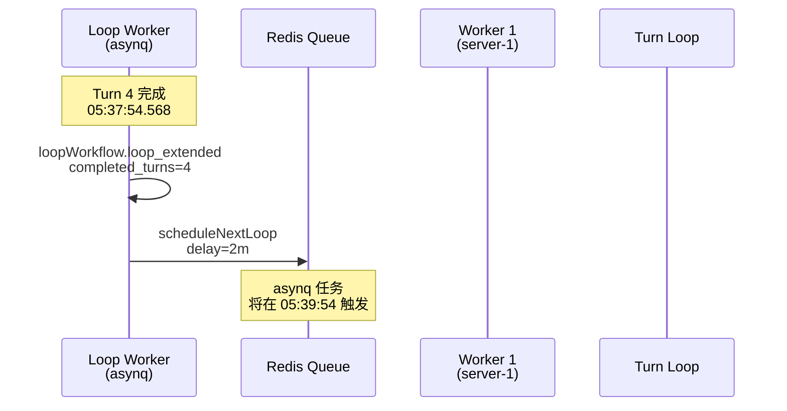
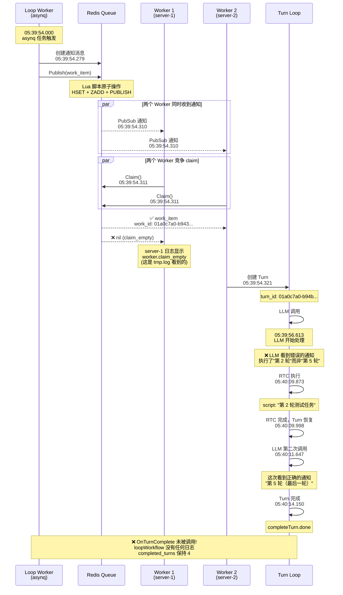

# Turn Loop 停止问题 - 完整根因分析

**日期**: 2026-09-22  
**Session**: `01a0c796-1ecc-72c9-80b9-b214e6ef6d68`  
**Loop**: `01a0c796-8fe7-74c7-a12d-b05e6a8a13b7`

## 执行摘要

Loop 在执行第 5 轮时停止，根本原因是 **OnTurnComplete hook 未被调用**，导致 `completed_turns` 没有递增，Loop 永久卡在 `active` 状态。

## 完整时间线

### 正常流程（Turn 1-4）



### 异常流程（Turn 5）



## 根因分析

### Bug 1：Worker 竞争（预期行为，不是 Bug）

**现象**：server-1 的 worker 收到通知但 claim_empty

**原因**：两个 worker（server-1 和 server-2）同时收到 PubSub 通知，竞争 claim 同一个 work_item。这是**预期行为**，不是 bug。

**证据**：
```
server-1: 05:39:54.311 worker.claim_empty
server-2: 05:39:54.311 worker.claimed (work_id: 01a0c7a0-b943...)
```

**结论**：work_item 被 server-2 成功取走并处理，这是正常的分布式竞争。

### Bug 2：LLM 执行错误任务（次要问题）

**现象**：LLM 第一次调用时执行了"第 2 轮"而非"第 5 轮"

**原因**：LLM 看到了历史通知消息，第一次调用时引用了旧通知（Turn 2 of 5）。

**证据**：
```
05:39:56.613  assistant thinking: "现在系统提醒说循环应该执行第2轮了（Turn 2 of 5）"
05:40:11.647  assistant thinking: "I need to execute the 5th turn (Turn 5 of 5)"
```

**影响**：虽然 LLM 第二次调用时自我纠正了，但第一次调用执行了错误的脚本。

**结论**：这是 LLM 的理解问题，不是系统 bug。可以通过过滤旧通知消息来优化。

### Bug 3：OnTurnComplete 未被调用（核心 Bug）❌

**现象**：Turn 完成（completeTurn.done）但 loopWorkflow 没有任何日志

**证据**：
```
05:40:14.150  [turnagent] completeTurn.done  turn_id=01a0c7a0-b94b...
              ❌ 没有 loopWorkflow.loop_extended 日志
              ❌ 没有 loopWorkflow.onTurnComplete 日志
```

**影响**：
- `completed_turns` 保持 4（应该是 5）
- `last_run_at` 保持 05:37:54（应该是 05:40:14）
- `asynq_task_id` 指向已触发的旧任务
- Loop 永久卡在 `active` 状态

**根本原因**：需要检查 `completeTurn` 到 `OnTurnComplete` 的调用链。

## 代码调用链分析

### 预期调用链

```go
// 1. Turn 完成
// pkg/turn-agent/turn_loop.go
func (l *TurnLoop) completeTurn(ctx context.Context) error {
    // ...
    
    // 2. 调用 command registry 的 hooks
    l.registry.OnTurnComplete(ctx)
    
    // ...
}

// 3. Command registry 调用所有 command 的 OnTurnComplete
// internal/agent/command/registry.go
func (r *CommandRegistry) OnTurnComplete(ctx Context) error {
    for _, cmd := range r.activeCommands {
        cmd.OnTurnComplete(ctx)
    }
}

// 4. LoopWorkflow.OnTurnComplete 被调用
// internal/agent/loop_workflow.go:112
func (l *LoopWorkflow) OnTurnComplete(ctx Context) error {
    l.logger.Info(ctx, "loopWorkflow.onTurnComplete", ...)
    // 更新 completed_turns
    // 调度下一个 asynq task
}
```

### 实际调用链（推测）

```
completeTurn.done
    ↓
❓ registry.OnTurnComplete() 被调用了吗？
    ↓
❓ LoopWorkflow.OnTurnComplete() 被调用了吗？
    ↓
❌ 没有日志输出
```

## 需要进一步调查

1. **检查 `completeTurn` 到 `registry.OnTurnComplete` 的调用**
   - 查看 `pkg/turn-agent/turn_loop.go` 中 `completeTurn` 的实现
   - 确认是否调用了 `registry.OnTurnComplete`

2. **检查 `registry.OnTurnComplete` 的实现**
   - 查看 `internal/agent/command/registry.go`
   - 确认是否正确调用了所有 active command 的 `OnTurnComplete`

3. **检查是否有错误被吞掉**
   - 查看 `completeTurn` 和 `registry.OnTurnComplete` 的错误处理
   - 确认是否有 panic 或 error 被捕获但没有记录

4. **检查 server-2 的完整日志**
   - 确认是否有其他错误日志
   - 确认是否有 goroutine 泄漏或 panic

## 临时解决方案

### 修复卡住的 Loop

```sql
-- 方案 1：标记为 exhausted（已完成 5 轮）
UPDATE loops 
SET status = 'exhausted', 
    completed_turns = 5,
    last_run_at = '2026-09-22 05:40:14',
    updated_at = NOW()
WHERE id = '01a0c796-8fe7-74c7-a12d-b05e6a8a13b7';

-- 方案 2：重新调度（继续执行）
UPDATE loops 
SET asynq_task_id = '',
    last_run_at = NOW() - interval '120 seconds',
    updated_at = NOW()
WHERE id = '01a0c796-8fe7-74c7-a12d-b05e6a8a13b7';
-- 然后依赖恢复机制重新调度
```

## 长期解决方案

### 方案 1：添加 Hook 调用日志（优先级：P0）

```go
// internal/agent/loop_workflow.go
func (l *LoopWorkflow) OnTurnComplete(ctx command.Context) error {
    // 添加入口日志
    l.helpers.logger.Info(ctx, "loopWorkflow.onTurnComplete.start", map[string]any{
        "session_id": ctx.SessionID.String(),
        "turn_id":    ctx.TurnID.String(),
    })
    
    defer func() {
        l.helpers.logger.Info(ctx, "loopWorkflow.onTurnComplete.end", map[string]any{
            "session_id": ctx.SessionID.String(),
            "turn_id":    ctx.TurnID.String(),
        })
    }()
    
    // ... 现有逻辑 ...
}
```

### 方案 2：添加 Hook 调用监控（优先级：P0）

```go
// pkg/turn-agent/turn_loop.go
func (l *TurnLoop) completeTurn(ctx context.Context) error {
    // ...
    
    // 调用 hooks
    startTime := time.Now()
    err := l.registry.OnTurnComplete(ctx)
    duration := time.Since(startTime)
    
    l.logger.Info(ctx, "turn.completeTurn.hooks_completed", map[string]any{
        "turn_id":  l.turnID.String(),
        "duration": duration.String(),
        "error":    err,
    })
    
    if err != nil {
        l.logger.Error(ctx, "turn.completeTurn.hooks_failed", map[string]any{
            "turn_id": l.turnID.String(),
            "error":   err.Error(),
        })
    }
    
    // ...
}
```

### 方案 3：添加 Loop 恢复机制（优先级：P1）

```go
// internal/loop/recovery.go
func (r *Recovery) RecoverStaleLoops(ctx context.Context) error {
    loops, err := r.loopRepo.FindAllActive(ctx)
    if err != nil {
        return err
    }
    
    for _, loop := range loops {
        // 检查 loop 是否卡住
        // 条件：last_run_at 超过 interval_seconds 且没有 pending task
        timeSinceLastRun := time.Since(loop.LastRunAt)
        intervalDuration := time.Duration(loop.IntervalSeconds) * time.Second
        
        if timeSinceLastRun > intervalDuration + 30*time.Second {
            // Loop 卡住了，记录告警
            r.logger.Warn(ctx, "loop.recovery.stale_loop_detected", map[string]any{
                "loop_id":          loop.ID.String(),
                "last_run_at":      loop.LastRunAt,
                "time_since_last":  timeSinceLastRun.String(),
                "completed_turns":  loop.CompletedTurns,
                "max_turns":        loop.MaxTurns,
            })
            
            // 尝试重新调度
            if err := r.rescheduleLoop(ctx, loop); err != nil {
                r.logger.Error(ctx, "loop.recovery.reschedule_failed", map[string]any{
                    "loop_id": loop.ID.String(),
                    "error":   err.Error(),
                })
            }
        }
    }
    
    return nil
}
```

### 方案 4：过滤旧通知消息（优先级：P2）

```go
// internal/agent/message_normalizer.go
func filterLoopNotifications(messages []*turnagent.Message) []*turnagent.Message {
    var latestLoopNotification *turnagent.Message
    var result []*turnagent.Message
    
    // 从后往前遍历，找到最新的 loop 通知
    for i := len(messages) - 1; i >= 0; i-- {
        msg := messages[i]
        if isLoopNotification(msg) {
            if latestLoopNotification == nil {
                latestLoopNotification = msg
            }
            continue // 跳过旧的通知
        }
        result = append([]*turnagent.Message{msg}, result...)
    }
    
    // 把最新的通知插回
    if latestLoopNotification != nil {
        result = append([]*turnagent.Message{latestLoopNotification}, result...)
    }
    
    return result
}
```

## 结论

**核心问题**：`OnTurnComplete` hook 未被调用，导致 Loop 状态未更新。

**下一步**：
1. 检查 `completeTurn` 到 `registry.OnTurnComplete` 的调用链
2. 添加 hook 调用日志和监控
3. 实现 Loop 恢复机制
4. （可选）优化通知消息过滤

**影响范围**：所有使用 Loop 功能的 session 都可能受到影响。

**紧急程度**：P0 - 需要立即修复。
